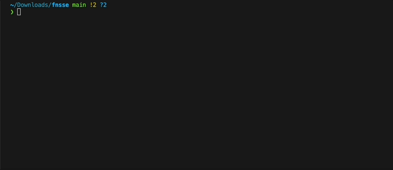
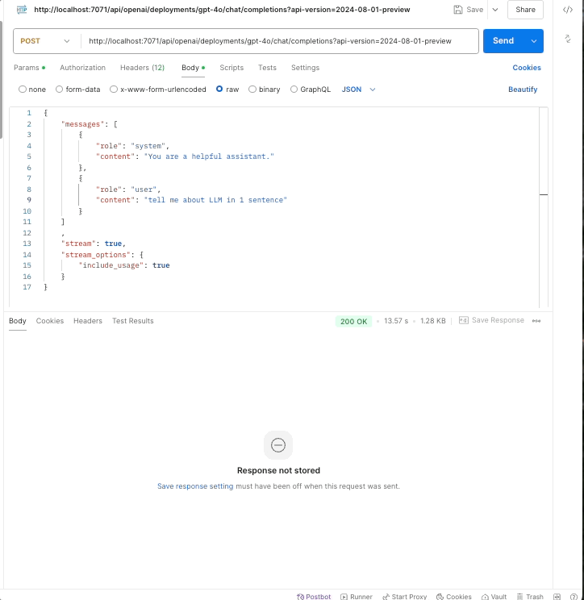
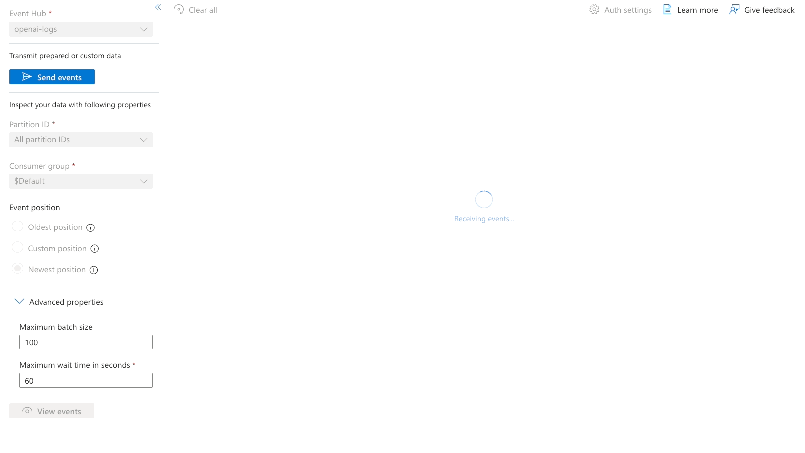

# Azure OpenAI Proxy Function

This Azure Function acts as a proxy for Azure OpenAI, supporting both streaming and non-streaming responses. It provides a simple way to interact with Azure OpenAI services while handling both Server-Sent Events (SSE) streaming and standard JSON responses.

This solution addresses two key limitations:
1. [APIM SSE Streaming limitation](https://learn.microsoft.com/en-us/azure/api-management/how-to-server-sent-events) for Event Hub Logging
2. Cost-based rate limiting and quota management for Azure OpenAI services

## Setup

### Prerequisites
- Azure subscription
- Azure Function App (Python)
- Azure OpenAI service instance
- Azure Cosmos DB (for rate limiting)

### Environment Variables
Copy `local.settings.sample.json` to `local.settings.json` and set the following environment variables:
or
Set the following environment variables in your Azure Function App:

```bash
az functionapp config appsettings set \
  --name fnsse \
  --resource-group fnsse \
  --settings \
  "AZURE_OPENAI_KEY=your_key_here" \
  "AZURE_OPENAI_API_VERSION=2024-08-01-preview" \
  "AZURE_OPENAI_BASE_URL=https://your-instance.openai.azure.com/" \
  "AZURE_EVENTHUB_CONN_STR=your_eventhub_connection_string" \
  "AZURE_EVENTHUB_NAME=openai-logs" \
  "CosmosDBConnection__accountEndpoint=your_cosmos_endpoint" \
  "PYTHON_ENABLE_INIT_INDEXING=1"
```

> Note: `PYTHON_ENABLE_INIT_INDEXING=1` is required for proper Python module initialization in Azure Functions.

## Demo

### Function Start

### API Call

### Event Hub



## Usage

### Endpoint
The endpoint matches the Azure OpenAI API signature:
```http
POST /openai/deployments/{deployment_name}/chat/completions?api-version=2024-08-01-preview
```

### Request Format

#### Non-streaming Request (Default)
```json
{
    "messages": [
        {
            "role": "system",
            "content": "You are a helpful assistant."
        },
        {
            "role": "user",
            "content": "Tell me about Singapore in 1 sentence"
        }
    ]
}
```

#### Streaming Request
```json
{
    "messages": [
        {
            "role": "system",
            "content": "You are a helpful assistant."
        },
        {
            "role": "user",
            "content": "Tell me about Singapore in 1 sentence"
        }
    ],
    "stream": true,
    "stream_options": {
        "include_usage": true
    }
}
```

### Response Format

#### Non-streaming Response
Standard Azure OpenAI response format:
```json
{
    "id": "chatcmpl-123",
    "object": "chat.completion",
    "created": 1677652288,
    "choices": [{
        "index": 0,
        "message": {
            "role": "assistant",
            "content": "Singapore is a highly developed city-state..."
        },
        "finish_reason": "stop"
    }],
    "usage": {
        "prompt_tokens": 25,
        "completion_tokens": 31,
        "total_tokens": 56
    }
}
```

#### Streaming Response
Server-Sent Events (SSE) format with chunks matching Azure OpenAI's format:
```
data: {"id":"chatcmpl-123","object":"chat.completion.chunk","created":1677652288,"choices":[{"index":0,"delta":{"role":"assistant"}}]}

data: {"id":"chatcmpl-123","object":"chat.completion.chunk","created":1677652288,"choices":[{"index":0,"delta":{"content":"Singapore"}}]}

data: {"id":"chatcmpl-123","object":"chat.completion.chunk","created":1677652288,"choices":[{"index":0,"delta":{"content":" is"}}]}

... more chunks ...

data: {"id":"chatcmpl-123","object":"chat.completion.chunk","created":1677652288,"usage":{"completion_tokens":31,"prompt_tokens":25,"total_tokens":56}}

data: [DONE]
```

#### Rate Limit Exceeded Response
```json
{
    "error": {
        "code": "QuotaExceeded",
        "message": "Rate limit quota exceeded. Accumulated cost: 5.000915, Quota: 5",
        "details": {
            "error": "QuotaExceeded",
            "message": "Rate limit quota exceeded. Accumulated cost: 5.000915, Quota: 5",
            "status_code": 429,
            "accumulated_cost": 5.000915,
            "quota": 5,
            "counter_key": "starter5",
            "quota_exceeded": true
        }
    }
}
```

### Response Headers
All responses include quota usage information in headers:
```
x-counter-key: starter5
x-accumulated-cost: 5.000915
x-quota: 5
```

## Event Hub Logging
The function automatically logs completion details to Azure Event Hub for both streaming and non-streaming responses:

### Non-streaming Log Format
```json
{
    "type": "completion",
    "content": "Singapore is a vibrant city-state...",
    "usage": {
        "completion_tokens": 137,
        "prompt_tokens": 25,
        "total_tokens": 162
    },
    "model": "gpt-4o",
    "prompt": [...],
    "region": "Australia East",
    "latency_ms": 1306,
    "timestamp": "2024-11-13T06:59:30.584946"
}
```

### Streaming Log Format
```json
{
    "type": "stream_completion",
    "content": "Singapore is a vibrant city-state...",
    "model": "gpt-4o",
    "usage": {
        "completion_tokens": 137,
        "prompt_tokens": 25,
        "total_tokens": 162
    },
    "prompt": [
        {
            "role": "system",
            "content": "You are a helpful assistant."
        },
        {
            "role": "user",
            "content": "Tell me about Singapore in 1 sentence"
        }
    ],
    "region": "Australia East",
    "latency_ms": 2650,
    "time_to_first_chunk_ms": 150,
    "streaming_duration_ms": 2500,
    "timestamp": "2024-11-13T06:59:30.584946"
}
```

### Understanding Timing Metrics
For streaming responses, three timing metrics are captured:

- `time_to_first_chunk_ms`: Time from request start until first token (includes queue time and model startup)
- `streaming_duration_ms`: Duration of token generation (actual model inference time)
- `latency_ms`: Total request duration (time_to_first_chunk_ms + streaming_duration_ms)

These metrics help identify:
- Queue waiting time in different regions
- Model warm-up and startup time
- Token generation speed
- Overall request latency

## Rate Limiting Configuration

### Rate Limit Parameters

| Parameter | Description | Example Value | Required |
|-----------|-------------|---------------|----------|
| `counterKey` | Unique identifier for tracking quota usage | `"starter10"` or `"user_12345"` | Yes |
| `quota` | Maximum cost allowed in the renewal period | `10` | Yes |
| `startDate` | When the quota period begins. If not provided, the system uses the time when the policy is first applied | `"2025-03-02T00:00:00Z"` | No |
| `renewal_period` | Seconds until quota resets (86400 = daily). If not provided, no automatic reset occurs | `86400` | No |
| `explicitEndDate` | Optional end date for the quota period | `null` or `"2025-12-31T23:59:59Z"` | No |
| `input_cost_per_token` | Custom cost per input token | `0.00003` | No |
| `output_cost_per_token` | Custom cost per output token | `0.00006` | No |

### APIM Integration

To integrate with Azure API Management, create a policy fragment that injects the rate limit configuration:

```xml
<set-variable name="rateLimitConfig" value="@{
    var productId = context.Product.Id;
    var config = new JObject();
    config["counterKey"] = productId;
    config["startDate"] = "2025-03-02T00:00:00Z";
    config["renewal_period"] = 86400;  // Daily renewal in seconds
    config["quota"] = 5;  // $5 daily quota
    return config.ToString();
}" />
<include-fragment fragment-id="RateLimitConfig" />
```

### Cosmos DB Setup

Create a Cosmos DB database named `ApimAOAI` with a container named `UserBudgets`. Deploy the stored procedure `updateAccumulatedCost` to this container. The stored procedure handles:

- Tracking accumulated costs
- Automatic quota resets based on renewal periods
- Quota enforcement

## Dependencies
- Python 3.9+
- `openai>=1.0.0`
- `azure-functions`
- `azure.functions.extensions.http.fastapi`
- `httpx`
- `azure-cosmos`
- `azure-identity`

## Deployment
Deploy the function to Azure Functions using the Azure CLI or Visual Studio Code.

```bash
func azure functionapp publish fnsse
```

## License
MIT